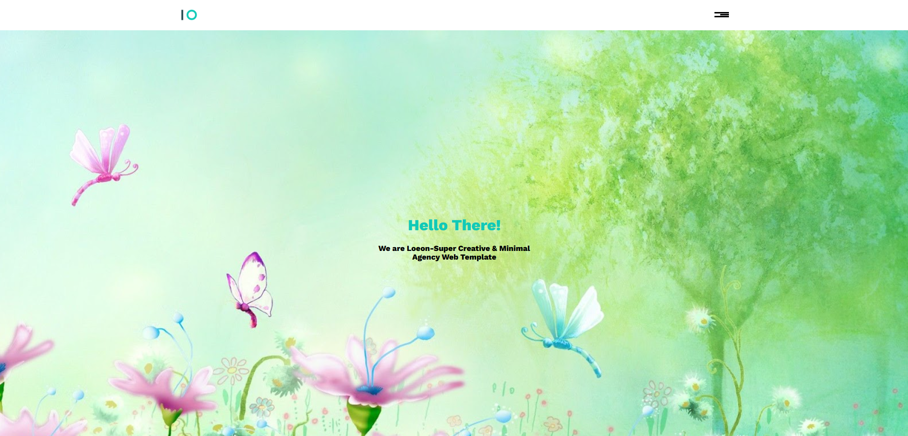
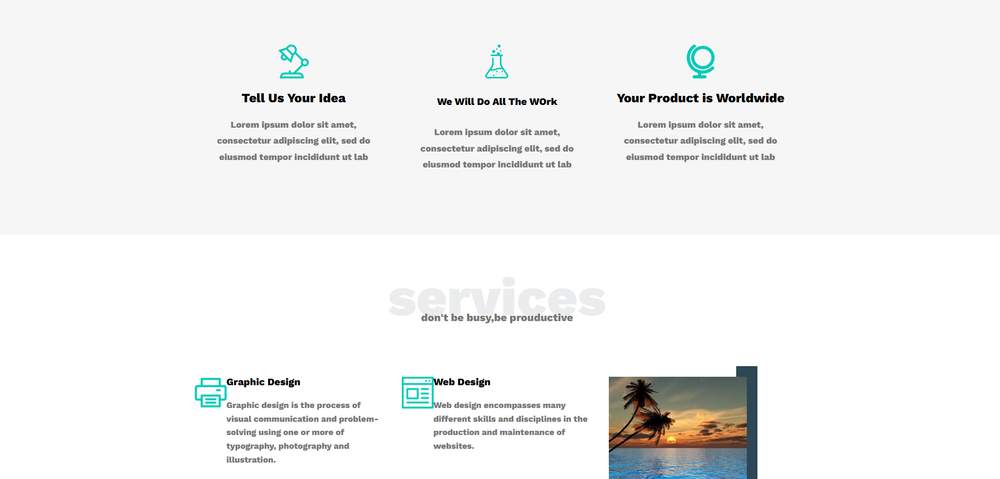
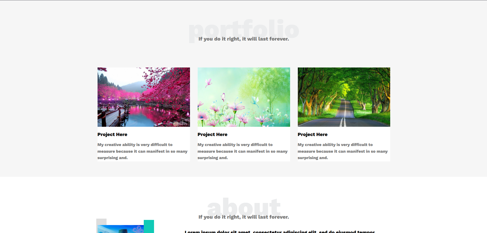
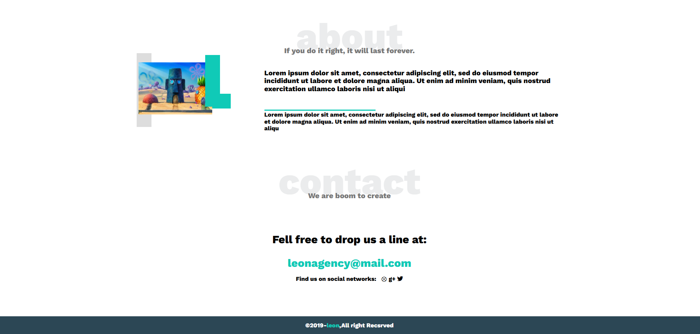

# Leon — Creative Agency Landing Page

🌐 Websites. A clean, minimal **single-page agency website** built with pure **HTML5** and **CSS3** — no frameworks, no build tools, no dependencies. Features CSS custom properties for instant theming, a custom hover-animated hamburger menu, CSS Grid layout for all sections, and smooth scroll navigation.

---

## 📸 Preview

| Preview 1 | Preview 2 |
|---|---|
|  |  |

| Preview 3 | Preview 4 |
|---|---|
|  |  |

---

## ✨ Features

- **Pure HTML5 & CSS3** — Zero JavaScript, zero frameworks, zero build steps
- **CSS Custom Properties** — Global theme colors and spacing controlled from `:root`
- **CSS Grid Layout** — Responsive auto-fill grid used across Features, Services, and Portfolio sections
- **Custom Hamburger Menu** — Pure CSS hover-animated 3-bar menu with animated middle bar and dropdown
- **Smooth Scroll** — Native `scroll-behavior: smooth` on all anchor links
- **Full-Height Hero** — Landing section fills `100vh` with full-cover background image
- **Decorative CSS Pseudo-elements** — `::before` / `::after` used for geometric accents on Services image and About section
- **Responsive Design** — Custom breakpoints at 768px, 992px, and 1200px via media queries
- **Work Sans Font** — Google Fonts display typeface (weight 800) for bold section titles
- **Font Awesome 5** — Self-hosted icon library (brands, regular, solid — eot/ttf/woff/woff2)
- **CSS Normalize** — Consistent cross-browser base styles

---

## 🗂️ Project Structure

```
tmplelet1/
│
├── index.html                  # Single-page HTML — all sections
│
├── css/
│   ├── lean.css                # 🎨 Main stylesheet — all custom styles
│   ├── normalize.css           # Cross-browser CSS reset
│   └── all.min.css             # Font Awesome 5 (self-hosted)
│
├── imag/                       # All images and icons
│   ├── logo.png                # Brand logo (header)
│   ├── img1.jpg                # Portfolio card 1
│   ├── img2.jpg                # Hero background + Portfolio card 2
│   ├── img3.jpg                # Portfolio card 3
│   ├── img4.jpg                # Services section image
│   ├── img5.jpg                # About section photo
│   ├── desk-lamp.png           # Features icon — "Tell Us Your Idea"
│   ├── flask.png               # Features icon — "We Will Do All The Work"
│   ├── world-globe-educational-tool.png  # Features icon — "Your Product is Worldwide"
│   ├── printing.png            # Service icon — Graphic Design
│   ├── chat.png                # Service icon — UI & UX
│   ├── web-design.png          # Service icon — Web Design
│   └── monitor.png             # Service icon — Web Development
│
└── webfonts/                   # Font Awesome 5 self-hosted font files
    ├── fa-brands-400.*         # Brand icons (eot, svg, ttf, woff, woff2)
    ├── fa-regular-400.*        # Regular icons
    └── fa-solid-900.*          # Solid icons
```

---

## 🚀 Getting Started

No installation, no build step, no terminal needed.

### 1. Clone the repository

```bash
git clone https://github.com/your-username/leon-agency.git
cd leon-agency
```

### 2. Open in browser

Simply open `index.html` in any modern browser:

```bash
# macOS
open index.html

# Windows
start index.html

# Linux
xdg-open index.html
```

Or use VS Code **Live Server** extension for auto-reload during development.

---

## 🎨 CSS Architecture

### CSS Custom Properties (`:root`)

All global design tokens live in one place in `lean.css`:

```css
:root {
  --main-color:      #10cab7;   /* Teal — headings, links, accents */
  --secondary-color: #2c4755;   /* Dark blue — footer background, decorative bars */
  --secton-padding:  60px;      /* Uniform top/bottom padding for all sections */
}
```

**To retheme the entire site**, change only these 3 variables — every section updates automatically.

### Color Palette

| Variable | Value | Used In |
|---|---|---|
| `--main-color` | `#10cab7` | Hero `h1`, contact link, About & Services accents, footer brand name |
| `--secondary-color` | `#2c4755` | Footer background, Services image decorative bar |
| `#ebeced` | Hardcoded | Giant section title watermark text (`.txetedite`) |
| `#f6f6f6` | Hardcoded | Alternate section backgrounds (Features, Portfolio, Contact) |
| `#777` | Hardcoded | Body paragraph text color |
| `#ddd` | Hardcoded | Hamburger dropdown background, About decorative span |

### Typography

| Font | Weight | Usage |
|---|---|---|
| Work Sans | 800 | Giant section watermark titles (`.txetedite`), headings |
| Work Sans | 300 | Body paragraphs in Services and Portfolio |
| Work Sans | default | All other text |

### Responsive Breakpoints

```css
/* Mobile — below 768px: hamburger menu, single-column grid */
@media (max-width: 768px) { ... }

/* Tablet — 768px and up */
@media (min-width: 768px)  { .container { width: 750px; } }

/* Desktop — 992px and up */
@media (min-width: 992px)  { .container { width: 970px; } }

/* Large — 1200px and up: Services image + About photo visible */
@media (min-width: 1200px) { .container { width: 1170px; } }
```

---

## 🖋️ HTML Structure (`index.html`)

The page is a single file with 7 semantic sections, all linked from the navbar:

```html
<header>           <!-- Logo + hover hamburger menu -->
<section.landing>  <!-- Full-height hero with background image -->
<section.features> <!-- 3-column icon + text grid -->
<section.services> <!-- 2-col service list + decorative image -->
<section.portfolio><!-- 3-col project cards -->
<section.about>    <!-- Photo with CSS accents + text -->
<section.Contact>  <!-- Email link + social handles -->
<footer>           <!-- Copyright bar -->
```

---

## 📄 Sections Overview

| Section | ID | Description |
|---|---|---|
| **Header** | — | Logo left, CSS-only hamburger menu right — middle bar animates to full width on hover; dropdown nav appears |
| **Landing / Hero** | `#Home` | Full viewport height, `img2.jpg` as cover background, teal `h1` greeting centered |
| **Features** | — | CSS Grid `auto-fill` 3-card row — each card has an icon, bold title, and description |
| **Services** | `#Srvices` | CSS Grid 3-column — two columns of service rows (icon left + text right), third column is a decorative image with `::before` colored bar |
| **Portfolio** | `#Protfolio` | CSS Grid 3-column — each card is a photo (63% height) + white text box (37% height) |
| **About** | `#About` | Flexbox — photo with teal `::before`/`::after` geometric accents (hidden on tablet), text column with teal underline rule |
| **Contact** | `#Contact` | Centered — invite text, teal `mailto:` link, social handles |
| **Footer** | — | Dark `--secondary-color` bar, teal brand name, copyright text |

---

## ⚡ CSS Techniques Highlights

### Hamburger Menu (Pure CSS)
```css
/* Middle bar starts at 60% width */
.menu .item span:nth-child(2) {
  width: 60%;
  transition: 0.3s;
}
/* Expands to 100% and dropdown appears on hover */
.menu:hover .item span:nth-child(2) { width: 100%; }
.menu:hover ul                      { display: block; }
```

### Section Title Watermark
```css
/* Giant light-gray text behind the section subtitle */
.txetedite {
  font-size: 100px;
  color: #ebeced;
  font-weight: 800;
}
.txetedite + p {
  margin-top: -30px; /* subtitle overlaps the giant title */
}
```

### Services Image Decorative Bar
```css
/* Vertical colored bar behind the image using ::before */
.sarvice-contante .imag::before {
  content: "";
  position: absolute;
  top: -20px; right: -20px;
  width: 40px;
  height: calc(100% + 40px);
  background-color: var(--secondary-color);
  z-index: -1;
}
```

### About Section Geometric Accents
```css
/* Teal bar top-right of the photo */
.about-contante .col1::before {
  background-color: var(--main-color);
  width: 40px; height: 140px;
  top: -20px; left: 180px;
}
/* Teal block bottom-left of the photo */
.about-contante .col1::after {
  background-color: var(--main-color);
  width: 50px; height: 40px;
  bottom: 80px;
}
```

---

## 🛠️ Built With

| Technology | Version | Purpose |
|---|---|---|
| HTML5 | — | Semantic page structure |
| CSS3 | — | All layout, animation, and theming |
| [Work Sans](https://fonts.google.com/specimen/Work+Sans) | weight 800 | Display typeface via Google Fonts |
| [Font Awesome](https://fontawesome.com/) | 5.x | Self-hosted icons (footer eye icon, social icons) |
| [normalize.css](https://necolas.github.io/normalize.css/) | — | Cross-browser CSS reset |

---

## 🌐 Browser Support

No build tools or transpilation — relies on native browser features:

| Feature | Support |
|---|---|
| CSS Custom Properties | ✅ All modern browsers |
| CSS Grid | ✅ All modern browsers |
| `scroll-behavior: smooth` | ✅ Chrome, Firefox, Edge, Safari 15.4+ |
| CSS `::before` / `::after` | ✅ All browsers |
| Fullscreen API | ✅ N/A — not used |
| IE | ❌ Not supported (CSS Grid + Custom Properties) |

---

## 📝 Customization Guide

**Change the brand color:** Edit `--main-color` in `lean.css`:
```css
:root {
  --main-color: #e74c3c; /* swap teal for red */
}
```

**Change section spacing:** Edit `--secton-padding`:
```css
:root {
  --secton-padding: 80px; /* increase all sections' vertical padding */
}
```

**Add a new service card:** In `index.html`, inside `.sarvice-contante .col`:
```html
<div class="srv">
  
  <div class="text">
    <h3>Your Service</h3>
    <p>Your service description here.</p>
  </div>
</div>
```

**Add a portfolio card:** In `index.html`, inside `.portfolio-contante`:
```html
<div class="col">
  <div class="imag1">
    
  </div>
  <div class="text1">
    <h3>Project Name</h3>
    <p>Short project description.</p>
  </div>
</div>
```

**Change the hero background:** In `lean.css`:
```css
.landing {
  background-image: url(../imag/your-hero-image.jpg);
}
```

**Update the contact email:** In `index.html`:
```html
<a href="mailto:your@email.com?subject=contact" target="_blank">
  your@email.com
</a>
```

---

## 📜 License

This project is open-source and available under the [MIT License](LICENSE).

The **Font Awesome 5** icons are licensed under [CC BY 4.0](https://creativecommons.org/licenses/by/4.0/) (icons) and [SIL OFL 1.1](https://scripts.sil.org/OFL) (fonts).

---

## 🙋 Author

**Alilo Alaedine**
- GitHub: [@your-username](https://github.com/your-username)

---

> ⭐ If you found this project useful, consider giving it a star on GitHub!
